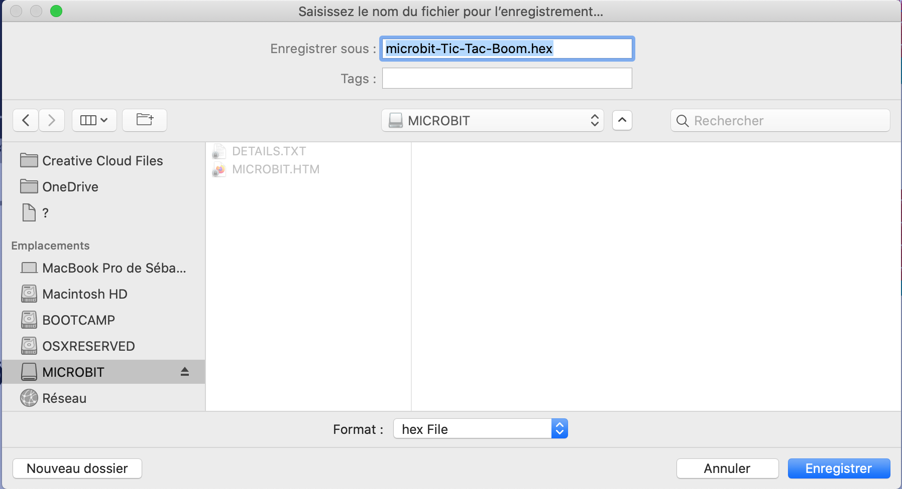

> Ouvrir cette page à [https://dudleysmith.github.io/tic-tac-boom/](https://dudleysmith.github.io/tic-tac-boom/)

# TIC, TAC, BOOOOOM !!!!!
Ce jeu se joue à deux équipes sur un terrain séparé en 2 parties.

Chaque équipe se renvoie la balle, d'un camp à l'autre.

Si la balle reste à terre trop longtemps, vous avez perdu !!!!

## Détails
Dans la chaussette, une carte contient.

## Pour modifier les mélodies
Intervertir les briques Orange avec d'autres

## Pour modifier le timing
Modifier le code dans la fonction "Relancer Compteur"

## Pour télécharger
Appuyer sur le bouton "télécharger" sous l'émulateur.

Copier / Uploader le fichier.hex dans la carte Micro::bit (Celle ci apparait dans l'explorateur de fichier sous le nom MICROBIT).

